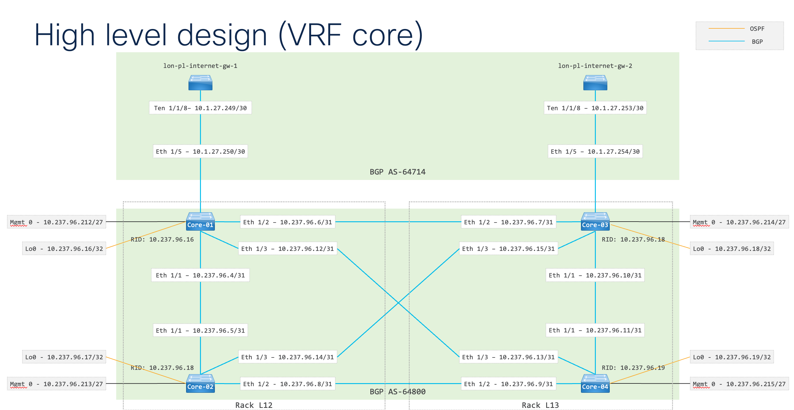

# Lab details for London Hyperfabric switches

There are two pairs of switches in the field lab; 2x Sirens and 2x Caribs. The hardware is physically located in racks L09 and L16 in the London data center. 

The switches are cabled to allow for multiple topologies:

- leaf only
- full mesh
- spine/leaf

Details can be found in the [/images](/images/) directory, along with connectivity details to the lab core. 

Each Hyperfabric environment has a unique AS along with lab local subnets from the 10.2.0.0/16 range. Workloads on the lab local subnets can access the internet via the lab NAT gateway. Both Hyperfabric environments attach directly to the lab core 

Each Hyperfabric also rack has 3x (very) old C series servers attached to the Siren switches. 

### Rack L09: AS65109

[Rack-l09 details](/images/hyperfabric-l09/rack-layout.png)

- 10.2.1.0/24
- 10.2.2.0/24
- 10.2.3.0/24
- 10.2.4.0/24
- 10.2.5.0/24
- etc

#### Host connectivity

The servers detailed below are very old and require Flash and Java to access the CIMC, this is possible only from an old jumphost in the lab. 

- UCS-C220-M3 - FCH1623VE85 | CIMC 10.237.98.25 | ESXi 7.0 update 3 | vmk0 10.237.102.29
- UCS-C220-M3 - FCH1736V26V | CIMC 10.237.98.26 | no OS
- UCS-C220-M3 - FCH1735V1LG | CIMC 10.237.98.27 | no OS

### Rack L16: AS65116

[Rack-l16 details](/images/hyperfabric-l16/rack-layout.png)

- 10.2.101.0/24
- 10.2.102.0/24
- 10.2.103.0/24
- 10.2.104.0/2410.237.
- 10.2.105.0/24
- etc

#### Host connectivity

The servers detailed below are very old and require Flash and Java to access the CIMC, this is possible only from an old jumphost in the lab. 

- UCS-C220-M3 - FCH1813V0B1 | CIMC 10.237.98.28 | ESXi 7.0 update 3 | vmk0 10.237.102.185 (dhcp)
  - CIMC 64:12:25:36:84:90 (connected to oob ToR Gig 1/0/5)
  - lom0 64:12:25:36:84:94 (connected to oob ToR Gig 1/0/13)
  - lom1 64:12:25:36:84:95 (not connected)
  - eth0 50:87:89:AA:B9:C3 (CIMC eth0 | ESXi vmnic2) - FDO283909D8 (RU39) eth 1/3
  - eth1 50:87:89:AA:B9:C4 (CIMC eth0 | ESXi vmnic3) - FDO283909DB (RU40) eth 1/3
- UCS-C220-M3 - FCH2003V1L8 | CIMC 10.237.98.29 | ESXi 7.0 update 3 | vmk0 10.237.102.188 (dhcp)
  - CIMC 00:C8:8B:42:AE:42 (connected to oob ToR Gig 1/0/6)
  - lom0 00:C8:8B:42:AE:46 (connected to oob ToR Gig 1/0/14)
  - lom1 00:C8:8B:42:AE:47 (not connected)
  - eth0 7C:AD:74:27:CE:EF (CIMC eth0 | ESXi vmnic2) - FDO283909D8 (RU39) eth 1/2
  - eth1 7C:AD:74:27:CE:F0 (CIMC eth0 | ESXi vmnic3) - FDO283909DB (RU40) eth 1/2
- UCS-C220-M3 - FCH2003V08P | CIMC 10.237.98.30 | ESXi 7.0 update 3 | vmk0 10.237.102.190 (dhcp)
  - CIMC 00:C8:8B:16:DB:6A (connected to oob ToR Gig 1/0/7)
  - lom0 00:C8:8B:16:DB:6E (connected to oob ToR Gig 1/0/15)
  - lom1 00:C8:8B:16:DB:6F (not connected)
  - eth0 4C:4E:35:09:52:B9 (CIMC eth0 | ESXi vmnic2) - FDO283909D8 (RU39) eth 1/1
  - eth1 4C:4E:35:09:52:BA (CIMC eth1 | ESXi vmnic3) - FDO283909DB (RU40) eth 1/1

### ACI connectivity

Both Hyperfabric racks are also attached to the aci-dev-01 fabric. This is still being commissioned, however it **should** be cabled as follows:

- L09 FDO283909CB eth 1/62 - aci-dev-01 leaf 1101 eth 1/17
- L09 FDO283909CH eth 1/62 - aci-dev-01 leaf 1102 eth 1/17
- L16 FDO283909DB eth 1/62 - aci-dev-01 leaf 2101 eth 1/17
- L16 FDO283909D8 eth 1/62 - aci-dev-01 leaf 2102 eth 1/17
